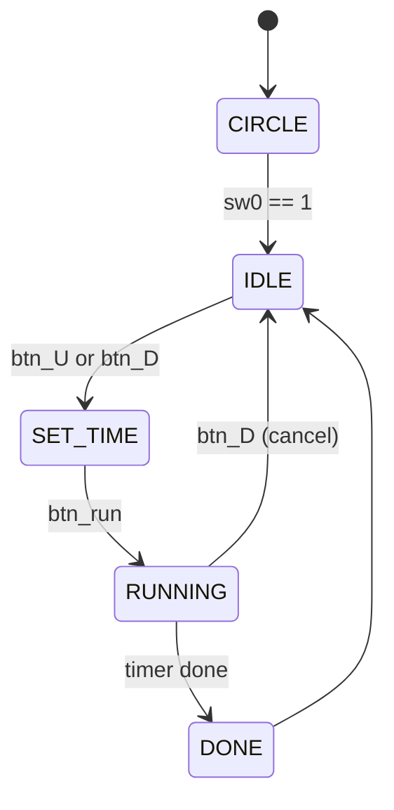

# 🔧 Verilog Microwave Oven System  

Basys3 FPGA 기반의 Verilog HDL 프로젝트로, 실생활 전자레인지의 핵심 기능을 디지털 회로로 구현하였습니다.

---

## 📌 프로젝트 개요

이 프로젝트는 전자레인지의 주요 기능을 FPGA 보드에서 구현한 것입니다.  
사용자는 버튼을 통해 시간을 설정하고, 조리 과정을 시작하며, 모터 및 서보, 부저를 통한 피드백을 제공합니다.

> 타이머 설정 → 모터 회전 및 동작 → 종료 시 알림음 및 서보 제어  

---

## 🛠️ 주요 기능 요약

| 기능                  | 설명 |
|-----------------------|------|
| ⏱ 타이머 설정         | 버튼으로 초 단위 시간 설정 (`btn_U`, `btn_D`) |
| ▶ 조리 시작/취소      | `btn_run`으로 시작, `btn_D`로 취소 가능 |
| 🔄 DC 모터 회전        | 조리 시간 동안 자동 PWM 회전 |
| 🔊 부저 출력          | 버튼 입력 시 BEEP, 종료 시 알림음 |
| 🔓 서보모터 문 제어   | `btn_L`로 열기, `btn_R`로 닫기 |
| 🖥 FND 디스플레이     | 남은 시간 출력 |
| 🧭 방향 제어          | SW14, SW15를 통해 DC 모터 방향 설정 가능 (`in1_in2`) |

---

## 🔩 프로젝트 구조

```
├── top_module.v               # 전체 시스템 통합 FSM
├── btn_controller.v           # 버튼 디바운싱 + 펄스 생성
├── fnd_controller.v           # FND로 남은 시간 표시 및 타이머 FSM
├── buzzer_controller.v        # 부저 제어
├── dc_controller.v            # DC 모터 PWM 제어 (타이머 연동)
├── servo_motor_controller.v   # 서보모터 PWM 제어 (수동 버튼)
```

---

## 🧠 시스템 동작 흐름



---

## 📐 입출력 핀 구성

| 핀/스위치    | 설명 |
|--------------|------|
| `btn_U`      | 시간 증가 |
| `btn_D`      | 시간 감소 / 취소 |
| `btn_L`      | 서보모터 문 열기 (0도) |
| `btn_R`      | 서보모터 문 닫기 (180도) |
| `btn_run`    | 조리 시작 |
| `sw`         | 모드 선택 |
| `sw14~15`    | DC 모터 방향 제어 |
| `in1_in2`    | DC 모터 제어 핀 |
| `PWM_OUT`    | DC 모터 PWM 출력 |
| `servo_out`  | 서보모터 PWM 출력 |
| `buzzer`     | 부저 신호 출력 |
| `seg_data`   | 7-segment 데이터 |
| `an`         | FND 자리 선택 |

---

## 🎥 시연 영상

👉 [YouTube 시연 영상 바로 보기](https://youtube.com/shorts/ziCvCQJrvrs)

> 영상에서는 버튼을 이용한 시간 설정, 조리 시작, DC 모터 회전, FND 출력, 서보모터 문 제어, 부저 반응 등의 전체 동작 흐름을 확인할 수 있습니다.

---

## ⚙️ 구현 상세

- **DC 모터는 타이머 동작 중 자동 회전**, 종료되면 PWM 출력이 0으로 꺼짐
- **서보모터는 버튼 입력(`btn_L`, `btn_R`)으로 직접 열고 닫음**
- **부저는 타이머 종료 시 알림음 출력**
- **FND는 남은 시간 출력 또는 0점멸 애니메이션**
- **모터 방향은 SW14, SW15에 따라 `in1_in2`로 전달**

---

## 🧪 테스트 및 시뮬레이션

- FPGA 실제 배치 후 하드웨어 디버깅 완료
- PWM 파형, FND 타이밍, 서보 제어 파형 모두 확인
- Simulation 없이 실제 동작 중심으로 검증

---

## 📁 Vivado 프로젝트 설정

- **Board**: Digilent Basys3 (Artix-7 xc7a35tcpg236-1)
- **Clock**: 100 MHz
- **Constraints**: Basys3-Master.xdc 사용

---

## 📌 참고

- 서보모터 PWM: 50Hz 기준 (1ms~2ms = 0도~180도)
- DC 모터 PWM: 10단계 듀티 설정 가능 (0~9)
- FND: 4-digit multiplexing 방식, timer 카운트와 blink 상태 병행 출력

---
