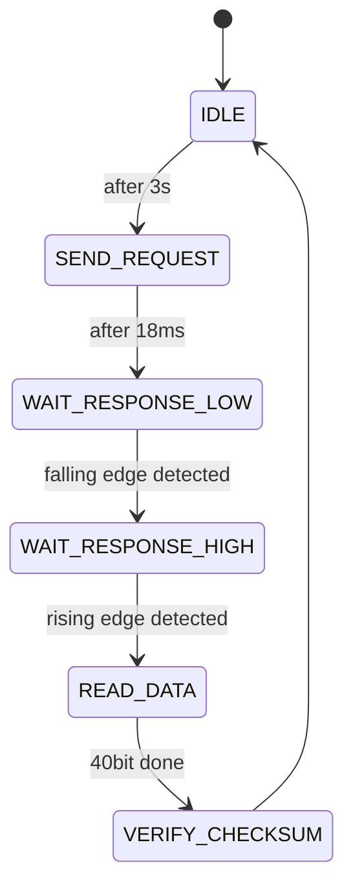
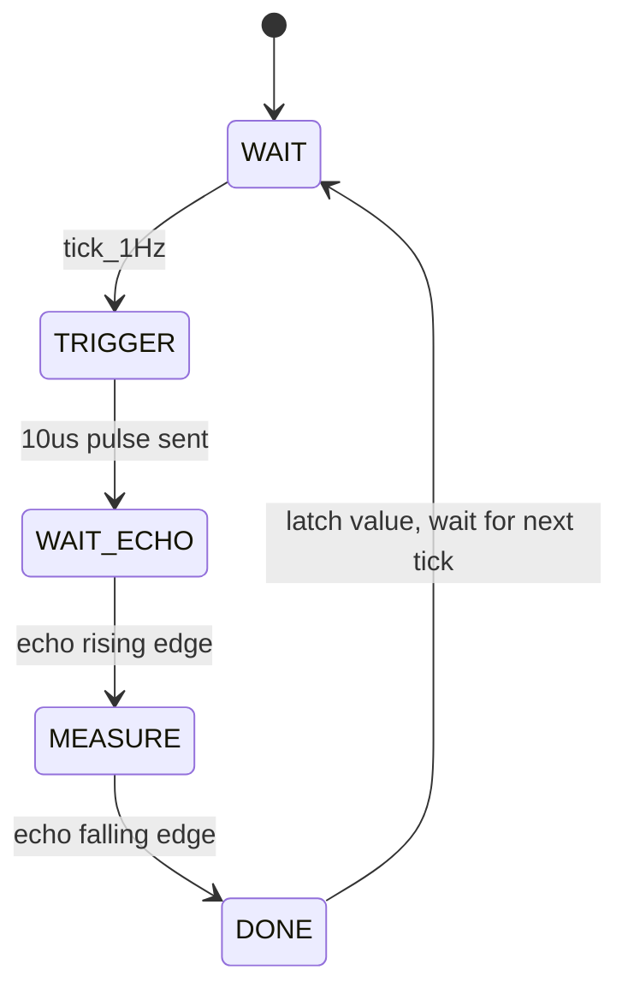
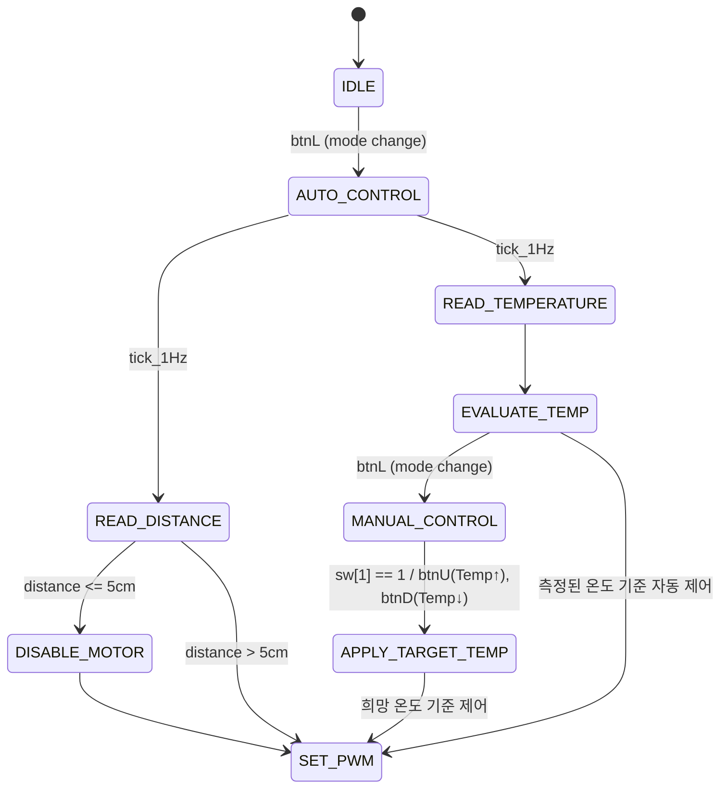
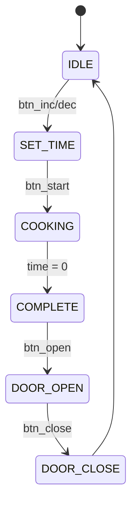
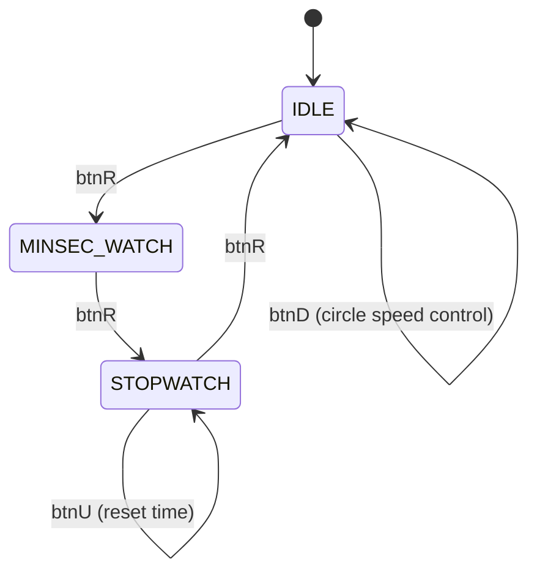

# 📦 BESPOKE 스마트 가전 FPGA 시스템

> 다양한 센서 및 액추에이터를 통합하여 구현한 스마트 가전 시뮬레이션 FPGA 프로젝트

---

## 📌 프로젝트 개요

이 프로젝트는 Vivado 기반 Basys3 보드에서 다음과 같은 스마트 가전 기능을 통합적으로 구현합니다:

* 초음파 거리 측정
* DHT11 온습도 센서 기반 HVAC 제어
* 전자레인지 기능 (타이머, 서보 제어, 부저 알림)
* UART 통신을 통한 측정값 전송 및 외부 명령 수신
* 스톱워치 / IDLE 애니메이션

---

## 🎯 주요 기능

| 모드             | 설명                                                                 |
|------------------|----------------------------------------------------------------------|
| MODE 0 (Idle)    | FND 순환 애니메이션 표시 (대기 상태)                                  |
| MODE 1 (공조기 자동) | 온습도 + 초음파 거리 측정 → 자동 모터 제어 (측정 온도 기준 PWM) + UART 전송       |
| MODE 2 (공조기 수동) | 온습도 측정 + 스위치·버튼으로 설정한 희망 온도에 따라 DC 모터 제어 + UART 전송     |
| MODE 3 (전자레인지) | 시간 설정 + 조리 동작 FSM + 서보모터 제어 + 종료시 부저 알림                    |
| MODE 4 (스톱워치)    | 실시간 스톱워치 카운트 FND 표시                                       |

---

## 📡 UART 포맷 명세

| 데이터 종류 | 포맷 예시                     | 설명                       |
| ------ | ------------------------- | ------------------------ |
| 초음파 거리 | `Dist:0123cm`             | 거리 측정 결과 (cm)            |
| 온도/습도  | `Temp:27.06C Humi:64.00%` | 정수 2자리 + 소수 2자리로 전송      |
| 오류 메시지 | `Error: DHT fail`         | DHT11 측정 실패 시 전송 (예정 기능) |

---

## ⚙️ 사용한 주요 모듈

### 센서 및 제어

* `hcsr04.v`: 초음파 거리 측정
* `dht11_controller.v`: 온습도 센서 제어 FSM
* `manual_temp_controller.v`: 수동 온도 설정 FSM
* `hvac_pwm_dcmotor.v`: 온도 기반 DC 모터 제어
* `mw_controller.v`, `mw_servo_motor.v`: 전자레인지 FSM

### 디스플레이 및 출력

* `fnd_controller.v`: 7-segment 표시 제어
* `idle_fnd.v`: IDLE 모드 애니메이션
* `buzzer_controller.v`: 부저 제어
* `uart_tx.v`, `data_sender.v`: UART 통신

### 공통 모듈

* `button_debounce.v`: 버튼 디바운싱
* `tick_generator.v`: 1Hz / 1us 등 클럭 분주기

---

## 🔁 FSM 다이어그램 요약 (Mermaid)

### 🧠 DHT11 FSM

### 🚶‍♂️ 초음파 FSM

### 🌬️ 공조기 FSM (HVAC 제어)

### 🔥 전자레인지 FSM

### ⏱ 분초시계 / 스톱워치 FSM

## 🧩 상세 구현 기능 정리

압축파일 내 Verilog 소스 기준으로 구현된 각 기능은 다음과 같습니다:

### ✅ 센서 및 입력 처리

| 파일명 | 기능 설명 |
|--------|----------|
| `hcsr04.v` | HC-SR04 초음파 센서 구동 및 거리 측정 |
| `dht11.v` / `dht11_controller.v` | DHT11 온습도 센서 통신 FSM |
| `manual_temp_controller.v` | 스위치 기반 수동 온도 설정 FSM |
| `button_debounce.v` | 버튼 디바운싱 회로 구현 (노이즈 방지) |

### ✅ DC 모터 / HVAC 제어

| 파일명 | 기능 설명 |
|--------|----------|
| `hvac_pwm_dcmotor.v` | 자동/수동 온도에 따라 DC 모터 PWM 제어 |
| `pwm_dcmotor.v`, `pwm_duty_cycle_control.v` | 일반 DC 모터 제어용 PWM 회로 |

### ✅ 전자레인지 시스템

| 파일명 | 기능 설명 |
|--------|----------|
| `microwave.v` | 전체 전자레인지 시스템 통합 |
| `mw_controller.v`, `mw_fsm_controller.v` | 조리 상태 FSM 제어 |
| `mw_servo_motor.v` | 서보 모터로 문 여닫기 |
| `mw_time_controller.v` | 조리 시간 설정 및 카운트 |

### ✅ 디스플레이 및 시각 출력

| 파일명 | 기능 설명 |
|--------|----------|
| `fnd_controller.v`, `fnd_controller_2.v` | 7-세그먼트 디스플레이 제어 |
| `idle_fnd.v` | IDLE 모드 애니메이션 출력 |
| `sw_fnd_controller.v`, `dht11_fnd_controller.v` | 스톱워치 및 온습도 값 디스플레이 |

### ✅ 스톱워치 / 타이머

| 파일명 | 기능 설명 |
|--------|----------|
| `minsec_stopwatch.v` | 분/초 단위 스톱워치 카운트 FSM |
| `sw_controller.v` | 스톱워치 모드 전환 및 동작 FSM |

### ✅ 부저 제어

| 파일명 | 기능 설명 |
|--------|----------|
| `buzzer_top.v` | 전체 부저 시스템 통합 |
| `power_on_buzzer.v`, `open_buzzer.v` | 버튼 기반 부저 제어 |
| `ultra_buzzer_controller.v` | 거리 경보용 부저 제어 FSM |

### ✅ UART 통신

| 파일명 | 기능 설명 |
|--------|----------|
| `uart_tx.v`, `uart_rx.v` | 송수신 회로 |
| `uart_controller.v` | 전체 UART 통신 제어 |
| `data_sender.v`, `dht11_data_sender.v` | UART 전송 포맷 관리 |

---

## 📽️ 시연 영상

| 영상 종류 | 링크 |
|----------|------|
| 📦 전체 동작 영상 | [동작 영상 보러가기](https://youtube.com/shorts/83tORA8PDt0?feature=share) |
| 📡 UART 통신 영상 | [comportmaster 출력 영상](https://youtube.com/shorts/UOM2bnoa3AQ?feature=share) |

---

## 💬 사용법

1. Vivado로 프로젝트 열기 (`15.BESPOKE.xpr`)
2. Top Module: `top`
3. bitstream 생성 후 Basys3에 다운로드
4. 스위치/버튼 조작 및 comportmaster로 UART 결과 확인

---

## 🔌 배선 및 Basys3 핀 할당 요약

| 기능            | 핀 이름                    | 연결 포트명                                               |
| ------------- | ----------------------- | ---------------------------------------------------- |
| 메인 클럭         | W5                      | `clk`                                                |
| 리셋 버튼         | R2                      | `reset`                                              |
| 스위치           | V17 \~ R2               | `sw[0] ~ sw[14]`                                     |
| 버튼            | W19, U18, T17, T18, U17 | `btn[0] ~ btn[4]`                                    |
| LED           | U16 \~ L1               | `led[0] ~ led[15]`                                   |
| 7세그먼트         | W7 \~ V7                | `seg[0] ~ seg[7]`                                    |
| Anode         | U2, U4, V4, W4          | `an[0] ~ an[3]`                                      |
| 초음파 센서        | B15, B16                | `echo`, `trig`                                       |
| DHT11 데이터     | R18                     | `dht11_data` (pull-up 적용)                            |
| 부저            | K17                     | `buzzer`                                             |
| DC 모터 제어      | JA1\~JA3                | `PWM_OUT`, `in1_in2[0]`, `in1_in2[1]`                |
| 서보모터          | JA4                     | `PWM_SERVO`                                          |
| HVAC DC 모터 제어 | J3, L3, M2              | `PWM_OUT_HVAC`, `in1_in2_HVAC[0]`, `in1_in2_HVAC[1]` |
| UART 통신       | A18, B18                | `RsTx`, `RsRx`                                       |

---

## 🛠 개발 환경

* Vivado 2021.1
* Basys3 FPGA 보드
* comportmaster 또는 Tera Term
* 100MHz 시스템 클럭 기준

---

## ✍️ 참고 및 기여

이 프로젝트는 임베디드 시스템, 센서 통합, 하드웨어 제어, UART 통신 등 실전 회로 설계 능력을 종합적으로 훈련하기 위해 설계되었습니다.

---
